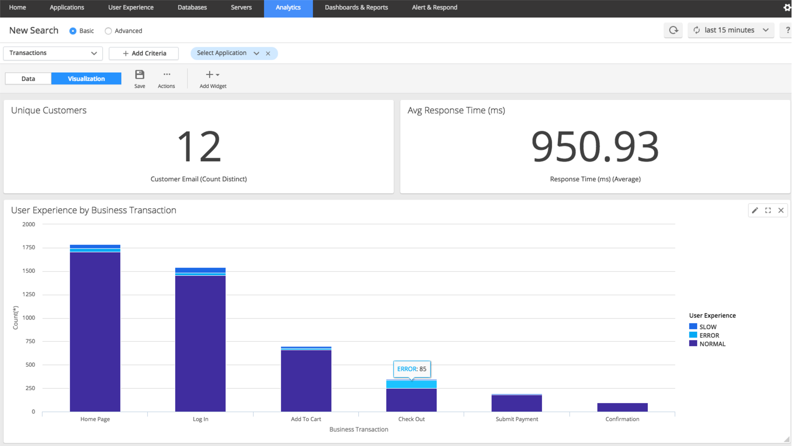
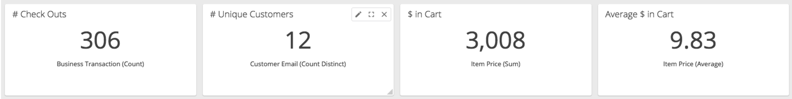
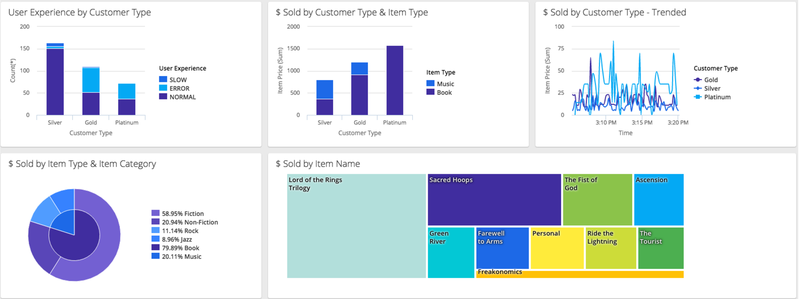
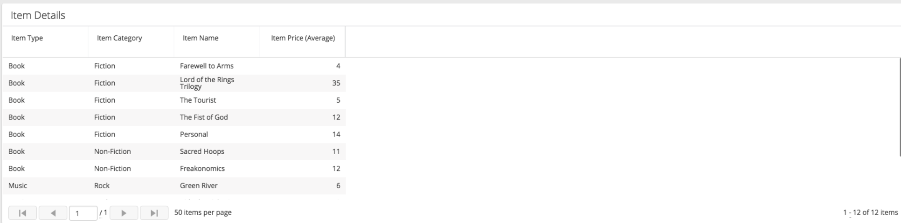
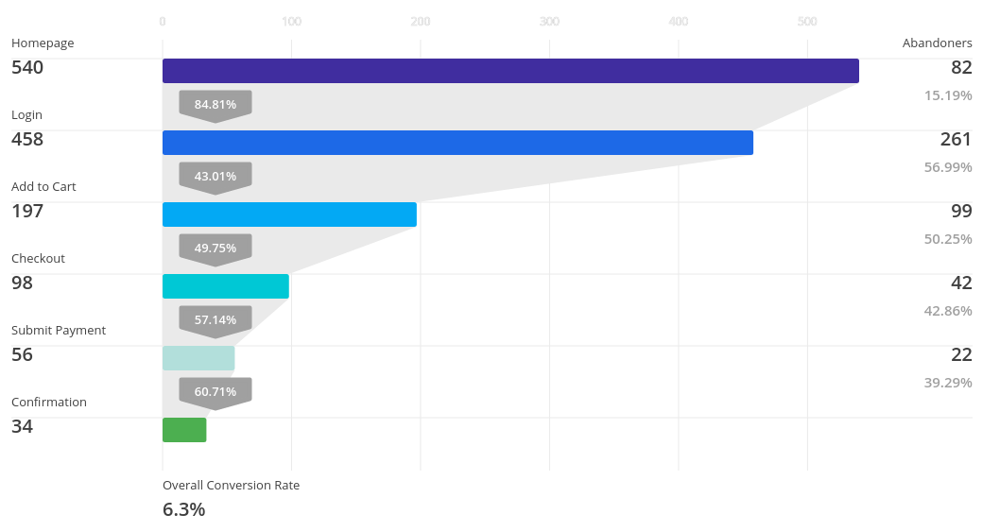

Business iQ Hands-On Lab
======
# 1. Accessing the Lab
## 1.1. Controller
* [Controller URL]
* Credentials
  * User: ```biz-iq-lab-<GROUPNUMBER>```
  * Password: ```biz-iq-lab-<GROUPNUMBER>```
  * **No leading 0 required here e.g. if you are Group 1 your password/user is biz-iq-lab-1**

## 1.2. Accessing the Lab Application

You can either run the Application via Docker on your local machine or use an already provisioned instance.

What's in it?
* Sample Application
* Java Application Agent
* Analytics Agent

### 1.2.1. Pre-Provisioned instance

* Linux/MacOS
  * Login ```ssh -p 80<GROUPNUMBER> root@52.58.178.223```(**Port is 4 digits long e.g if you are Group 1 your Port is 8001**)
  * Password ```biz-iq-lab-<GROUPNUMBER>``` (**No leading 0 required here e.g. if you are Group 1 your password is biz-iq-lab-1**)
* Windows
  * [Download Putty]
  * In the Hostname Field put in the IP ```52.58.178.223```
  * In the ```Port```field put in ```80<GROUPNUMBER>``` (**Port is 4 digits long e.g if you are Group 1 your Port is 8001**)
  * **Click** Open
  * Use ```root``` as the User
  * Password ```biz-iq-lab-<GROUPNUMBER>``` (**No leading 0 required here e.g. if you are Group 1 your password is biz-iq-lab-1**)

### 1.2.2. Build your own (Optional)

**Docker is a Pre-Requisite do perform these steps**

* Clone this repository ```$ git clone https://github.com/michaelenglert/AppD_Summit_BiQ_Lab```
* Change into Docker directory ```cd AppD_Summit_BiQ_Lab/Docker```
* Create Image ```./run.sh```
  * The script will prompt for your AppDynamics Portal Credentials (Two-Factor Authentication is **not supported**)
* Run the container ```docker run -d -e APPDYNAMICS_AGENT_APPLICATION_NAME=<YOUR APPLICATION> --name <NAME> michi/biqlab```
* Open a console ```docker exec -ti <NAME> /bin/bash```

# 2. Setup Analytics

## 2.1. Configure the Analytics Agent

* Edit the Properties File ```vi /analytics-agent/conf/analytics-agent.properties``` (**If you have never used vi use the alternative option below**)
  * ad.controller.url=https://appd-ga.appd.duckdns.org **(New in 4.3)**
  * http.event.endpoint=https://events.appd.duckdns.org
  * http.event.name=customer1 **(New in 4.3)**
  * http.event.accountName=customer1_bacabe1d-9659-4250-857f-5818619da483
  * http.event.accessKey=H16h53cur3
  * **Non vi User Option**
    * ```sed -i -e 's/http:\/\/localhost:8090/https:\/\/appd-ga.appd.duckdns.org/g' /analytics-agent/conf/analytics-agent.properties```
    * ```sed -i -e 's/http:\/\/localhost:9080/https:\/\/events.appd.duckdns.org/g' /analytics-agent/conf/analytics-agent.properties```
    * ```sed -i -e 's/analytics-customer1/customer1_bacabe1d-9659-4250-857f-5818619da483/g' /analytics-agent/conf/analytics-agent.properties```
    * ```sed -i -e 's/your-account-access-key/H16h53cur3/g' /analytics-agent/conf/analytics-agent.properties```
* Start the Analytics Agent ```nohup /analytics-agent/bin/analytics-agent.sh start &```

## 2.2. Enable Analytics in the Controller UI

* Login to the [Controller URL]
* Navigate to ```Analytics -> Configuration -> Transaction Analytics```
* Select ```biz-iq-lab-<GROUPNUMBER>``` under the ```Configure Analytics for Application``` Dropdown
* Click on the checkbox ```Enable Analytics Data Collection for biz-iq-lab-<GROUPNUMBER>```
* Wait 1-2 minutes
* Navigate to ```Analytics -> Searches```
* Click the ```Add``` Button and Select any of the available options
* You should now see Transactions in the UI
* **Ask your Instructor if this does not happen**

# 3. Enhance your Transactions with more Data

## 3.1. Get the Session ID

* Look at the [Main Business Logic] (**Answer below**)
  * Find the getter Method returning the Session ID as a String
  * Find a Method which is executed within every Transaction (homePage, logIn,...)
* Configure the Method Invocation Data Collector
  * Navigate to ```Analytics -> Configuration -> Transaction Analytics```
  * Select ```biz-iq-lab-<GROUPNUMBER>``` under the ```Configure Analytics for Application``` Dropdown
  * Add a new Data Collector under ```Method Invocation Data Collectors```
  * Give it a Name like **SessionID**
  * Make sure ```Transaction Snapshots``` and ```Transaction Analytics``` are checked
  * Define the Class Name ```com.appdynamics.eCommerceThread```
  * Define the Method Name ```processTransaction```
  * Add a Collector under ```Specify the Data to Collect from this Method Invocation```
    * Name it **SessionID**
    * Select ```Invoked Object```
    * Select ```Use Getter Chain``` and type in ```getSessionID()```
    * Hit ```Save```
    * Apply the Collector to all your Business Transactions
* Wait 1-2 minutes (**You can already configure the Data Collector in Section 3.2.**)
* You should now see your new Field within the Analytics UI
* **Ask your Instructor if this does not happen**

## 3.2. Get Data from Checkout

* Look at the [Main Business Logic]
  * Find the ```checkOut``` Method
* Add a new Data Collector as before to get additional Data
* **Copy the exact parameter name as name for the Data Collector**
* **Hints**
  * Use the ```Method Parameter``` Option instead of ```Invoked Object```before
  * You can stick to ```toString()``` No need to specify a custom getter Chain
  * You can add multiple Parameters within one Data Collector
  * Make sure you use the correct ```Method Parameter Index```
  * Make sure to apply this Data Collector only to your ```eCom.checkOut``` Business Transaction
  * Add these parameters:
    * ```customerType```
    * ```customerEmail```
    * ```productType```
    * ```productCategory```
    * ```productName```
    * ```itemPrice```

# 4. Exploring your Data

* Navigate to ```Analytics -> Searches```
* Click the ```Add``` Button and Select ```Drag and Drop Search```

## 4.1. Fields

The **Fields** section on the **left side navigation** shows all of the default data the AppDynamics collects for every transaction.

Scroll down in the left navigation and you will see the **Custom Method Data** that was configured in the previous section.  Click on the checkbox next to Field and you will see a new column appear in the result set with the additional data.

## 4.2. Search Criteria

All of the available data elements can be used to filter the current result set.  There are two different ways to filter.  

You can add filters by clicking on the ```+ Add Criteria``` Button.

**Note:** You MUST select an Application in Transaction Analytics before you can filter by Business Transaction.

You can also add filter criteria by **left clicking on the field names** and selecting a value.

## 4.3. Building Visuals

Now that we know how to navigate our data, let’s build our first visualization.  We will start by creating a simple visualization for the overall performance of our  application.

* **Click** on the ```Visualization``` button
* **Click** on the ```Add Widget``` button
* **Click** on ```Custom Widget Builder```

Custom widgets allow you to create different visualizations of your data.  Let’s create a KPI for how many unique customers are on the site.

* Drag and drop the ```customerEmail``` field into the ```Y Axis```.  

The Y Axis is used for numeric metrics.  If you use a String field you can either use Count (which is always the # of transactions) or Count Distinct, which is the distinct # of values of that field.

* **Click** on the field and change the ```Aggregation``` to ```Count Distinct```
* **Click** Save
* **Click** on the ```Numeric``` chart type
* You can give the Widget a name by typing one in to the top left corner of the box
* Finally, **Click** ```Add & Close Widget Builder```

Now the widget has been added to your canvas. You can resize it by clicking the corners and dragging to the desired fit.

* **Add** another custom widget using the same steps
* This time **drag** the ```Response Time (ms)``` field into the ```Y Axis```
* **Select** ```Average``` for the aggregation.  
* **Configure** this widget to be a ```Numeric Chart``` type like Unique Customers.

**Notice** that numeric fields have different aggregation options than string fields.

Now let’s break down your applications user experience by business transaction.  

* **Create** another custom widget
* **Drag** ```Business Transaction``` to the ```X Axis```
  * Since we did not populate the ```Y Axis```, our metric will default to # of transactions.
* Bar and Pie charts can have a second grouping on the X Axis.  
* **Drag** ```User Experience``` to the X Axis.  
* Now we can see a user experience break out by each Business Transaction.

Your Visualization should look like this now:


Click on the ```Save``` button and give the search a name.  Notice that it will now appear on your searches page as a Saved Search.

**Please Prepend your <GROUPNUMBER>- when saving something**

## 4.4. Ad-hoc Analysis

Now let’s revisit the interesting data point we saw in our last saved search.  The Check Out business transaction seems to be experiencing a high error rate.  Let’s build a more comprehensive visualization and try to find out why this is the case and what users are impacted.

* Create a new search and add the following search criteria
  * Application - ```biz-iq-lab-<GROUPNUMBER>```
  * Business Transaction - ```eCom.checkOut```
* Add the following ```Numeric chart``` types, as we learned in the last section (Hint: look at the field names and aggregation types under the metrics):

* Finally add the following various visuals, as we learned in the last section (Hint: there are a few new chart types to experiment with).



A few interesting observations can be made on our data set.
* Most of our customers by volume tend to be Silver customers, while most of our customers by $ sold tend to be Platinum customers.  Higher value customers account for a much greater $ amount in sales.
* Gold and Platinum customers are having a much higher error rate on Check Out than Silver customers, which is a major problem since they account for a much higher portion of our sales.
* Our average cart value is around $10 and books tend to be our best sellers.
* In the last 15 minutes users attempting to Check Out had around $3,000 in their cart.

Let’s continue our investigation by looking at what is happening with our Errors on Check Out. ```Add User Experience = Error to filter criteria```.

Now we are only looking at Error transactions. Notice that more than half of our $ in Cart had errors, potential resulting in lost sales!  Unfortunately, our Platinum users are the ones primarily impacted.  Let’s further refine our data set, ```add Customer Type = Platinum to filter criteria```.

Now we can see a potential underlying issue.  It looks as though nearly all of the Platinum errors are associated with customers trying to purchase the Lord of the Rings Trilogy, which is much more expensive than most of our books and gives our users around a 4x average cart value.  Very quickly we were able to utilize Performance and Business information to get an immediate understanding of how our Business is being impacted in real time! **Make sure you save your search**.

**Please Prepend your** ```<GROUPNUMBER>-``` **when saving something**

# 5. Acting on your Data

## 5.1. Exporting Data

In addition to leveraging snapshots, you can also add error details directly in your data tab.  Select the ```checkbox``` next to ```Error Details``` in the fields section.

It looks like the issue with Lord of the Rings is that we do not have a valid SKU associated with it, perhaps an issue updating our product catalog / database correctly.

We can also select the ```checkbox``` next to ```Customer Email``` and view the exact customers who were impacted (in production environments you can use some form of customer token to avoid collecting sensitive information).

**Click** on the ```Actions``` button and select ```Export``` to save your data set into a CSV file.  AppDynamics also has a REST API for programmatically exporting data.  This data can be sent to both your development team to quickly fix the issue and sales / marketing team to reach out to affected customers.

## 5.2. Building Metrics

You can also leverage Analytics Searches to create metrics.  These metrics work just like APM metrics (gathered every minute, baseline enabled, used for health rules, etc.).  With Analytics you can create more fine-tuned business alerting than with standard APM.

Analytics metrics are based on the # of results of a search.  Let’s create a metric on the error rate for Platinum customers, which would be useful for our eCommerce site based on what we uncovered in the last section.   Later we will use this metric for alerting purposes so we can proactively identify when our most critical customers are experiencing issues.

* **Create a new search** with the following criteria:
  * Application - ```biz-iq-lab-<GROUPNUMBER>```
  * User Experience - ```Error```
  * Customer Type - ```Platinum```
* Save the Search as ```<GROUPNUMBER>-Platinum Customer Errors```
* **Click** on the ```Actions``` button
* **Click** ```Create Metric```
* Name the metric ```<GROUPNUMBER>-Platinum Customer Errors```
* **Click** on ```Metrics``` in the left side Navigation and notice that your new metric has been created
* After a few minutes your new metric will start reporting in.  You can view it using the ```Metric Browser```

# 6. AppDynamics Query Language

AppDynamics also provides a SQL-like query language for accessing Analytics data.  Some users might prefer to use a query language while others will need to take advantage of its additional functionality to create advanced queries and visualizations.

## 6.1. Simple Query

* ```Add``` a new search and select ```Query Language Search```
* **Erase** ```*``` and start typing customer
* You will see a predictive query window pop up and suggest relevant fields.  
* **Select** ```customerType``` and hit tab.  

Note: fields with spaces in them need to be enclosed in a backtick. The SELECT statement of the query indicates the columns of data you want to show up in the results.
* Complete the query by adding ```userExperience``` and ```count(*)``` to the ```SELECT``` statement

This query shows the # of transactions broken out by customer type and user experience.  The full query for reference is ```SELECT segments.userData.customerType, userExperience, count(*) FROM transactions```

## 6.2. Advanced Query

Now let’s create a more advanced query using the ```filter``` statement and ```math``` operators.  Our use case is to find the % error rate for platinum customers across all business transactions.  

The ```filter``` statement allows you to create a subset of data from the existing query.  In our example below we want to look at only error transactions (the subset) divided by the total # of transactions (the results of the main query).  The first section of the filter function is the column of data you want and the second section defines the WHERE clause that creates the subset of data.

The ```math``` operators allow you to do addition, subtraction, multiplication, division and modulus operations on the data.  They can be used in conjunction with other functions like filter, and you can also use parenthesis for order of operations.  NOTE: you must multiply numerators in a division operation by 1.0 to cast them to a decimal value if the value is a whole number, otherwise fractions will be rounded to the nearest whole number.

The ```AS``` statement allows you to create an alias for the column name of your new calculated value.

Try the following query, which gives us error rate across our entire data set: ```SELECT (filter(count(*), WHERE userExperience = "ERROR") * 1.0) / count(*) * 100 AS ErrorRate FROM transactions WHERE application = "biz-iq-lab-<GROUPNUMBER>"```

Looks like across all customers we currently have around a 3 to 4 % error rate.  Let’s further filter to Platinum customers only by adding Customer Type to the WHERE clause, which lets us filter our results: ```SELECT (filter(count(*), WHERE userExperience = "ERROR") * 1.0) / count(*) * 100 AS ErrorRate FROM transactions WHERE application = "biz-iq-lab-<GROUPNUMBER>" AND segments.userData.customerType = "Platinum"```


Interestingly our Platinum customers are experiencing a **MUCH** higher error rate at almost 50 %.   

Select ```Numeric``` as the ```chart type``` and **save the search** as ```<GROUPNUMBER>-Platinum Customer Error %```.

# 7. Integrating with Alerts & Custom Dashboards

## 7.1. Creating an Analytics Alert

Now let’s create an alert on the Platinum Customer Error metric we created in the previous section.  
* **Click** on ```Alert & Respond``` in the top navigation
* **Click** on the ```Select…``` drop down and **click** on ```Analytics```.
* **Click** on ```Health Rules```.
* **Click** on the ```+``` button.

This health rule will monitor the condition of our ```<GROUPNUMBER>-Platinum Customer Error``` metric. In the ```Overview``` tab give the health rule the name ```<GROUPNUMBER>-Platinum Customer Errors```, and Use the last 5 minutes of data (so we can see the effects of the rule quickly). **DO NOT click the Save button yet**.

* **Click** on the ```Warning Condition``` tab.  

This tab allows us to proactively alert with a “yellow” warning condition before the situation turns critical with our Platinum Customers.
* **Click** on ```Select a Metric```.
* **Select** the ```<GROUPNUMBER>-Platinum Custom Errors``` metric
* **Click** the ```Select``` button.

Normally we would use a baseline to understand when this metric deviates from normal conditions, but for lab purposes we will use a specific value so we can show the condition turning red on our dashboard (since we already know there is a problem).  
* Use ```> Specific Value = 0```.  **DO NOT click the Save button yet.**
* Finally, we can also set a “red” ```Critical Condition```.   
* **Select** the ```<GROUPNUMBER>-Platinum Customer Errors``` metric
* Use ```> Specific Value = 5```.
* **Click** the ```Save``` button

After 5 minutes you should see the condition turning Warning / Critical as in the image below.  Now we can be proactively alerted when there are problems with Platinum Customers specifically!  You can incorporate this health rule into a policy that sends and email, etc.

## 7.2. Add Analytics Data to Custom Dashboards

Let’s leverage our Analytics data within a Dashboard to complete our view of Business iQ for the eCommerce application.
* **Click** on Dashboards & Reports in the top navigation
* **Click** on ```+ Create Dashboard```
* Give a Name to the Dashboard and prepend your <GROUPNUMBER>-

From the observation done before we want to create a comprehensive view on the data. Let's find the corresponding Widget for the following and position them on the Dashboard:

* Health Status of our ```<GROUPNUMBER>-Platinum Customer Errors``` Rule
* Numeric Value of our Analytics Search ```<GROUPNUMBER>-Platinum Customer Error %```

Finally, let’s create a special Analytics visualization for our Application. A Conversion funnel helps to visualize the flow of users or events through a multi step process in an application to better understand which steps can be optimized for success.

* **Click** on ```+ Add Widget```
* **Select** ```Funnel Analysis``` under ```Analytics```
* ```+ Add Criteria``` for Application - ```biz-iq-lab-<GROUPNUMBER>```

The first step of funnel creation is to select the unique value that passes through each step in the funnel process.

* **Click** on the drop down for ```Count Distinct``` of and select ```SessionID```
  * The SessionID persists through each step in the funnel
* Give the first step the name of ```Homepage```
* Then ```+ Add Criteria``` for Application - ```biz-iq-lab-<GROUPNUMBER>``` and Business Transaction - ```ecom.homePage```

The Homepage is the first step that our customers encounter when they use the eCommerce application.

Now we will continue to add the remaining steps that our customers take when attempting to buys products, which is a successful “conversion” once they have a confirmed order.  We expect that each additional step will have equal to or less customers than the previous step, as some customers will choose to not purchase products at various steps of the buying process.  

* Repeat the previous ```+ Add Funnel Step``` for the additional steps in the funnel.  In order:
  * Log In
  * Add to Cart
  * Check Out
  * Submit Payment
  * Confirmation
* **Click** ```Save``` when you are finished

Your final conversion funnel should look like the image below:



Business iQ allows you to use all of your relevant application data (performance metrics, information points, analytics data, health rules, etc.) to get a complete end to end picture of the health of your business and proactively take action when issues are detected to protect your business.

# 8. Log Analytics (Optional)

[Download Putty]: http://www.putty.org/
[Main Business Logic]: /com/appdynamics/eCommerceThread.java
[controller url]: https://appd-ga.appd.duckdns.org
[events url]: https://events.appd.duckdns.org
